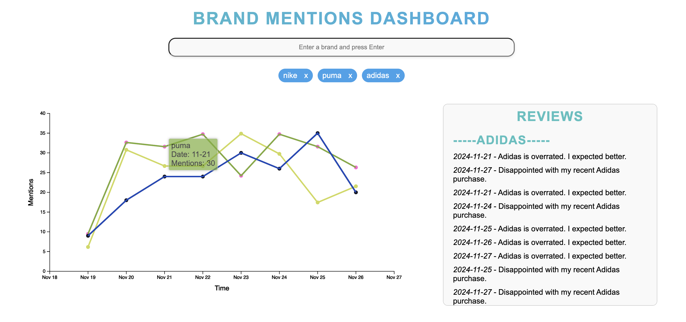

# Brand Mentions Dashboard

This project visualizes brand mentions from media sources in the last 7 days and
allows users to analyze reviews dynamically. The dashboard is built using
**Flask** for the backend, **D3.js** for chart visualization, and
**Elasticsearch** for data storage and retrieval.

## Table of Contents

- [Features](#features)
- [Technologies Used](#technologies-used)
- [Project Setup](#project-setup)
  - [Prerequisites](#prerequisites)
  - [Installation](#installation)
  - [Running the Application](#running-the-application)
- [Endpoints](#endpoints)
- [Data Generation](#data-generation)
- [Frontend Functionality](#frontend-functionality)
- [Folder Structure](#folder-structure)
- [Future Enhancements](#future-enhancements)
- [Contact](#contact)

---

## Features

1. **Visualize Brand Mentions**:

   - Interactive line chart displaying mentions over time.
   - Click on a line to view corresponding reviews.

2. **Dynamic Review Fetching**:

   - Fetch and display reviews from Elasticsearch dynamically for the selected
     brand.

3. **Scrollable Reviews Section**:

   - Reviews are displayed in a scrollable container, dynamically styled and
     updated.

4. **Fake Data Generator**:
   - Generate mock data for testing, including dates, times, brands, and sample
     reviews.



---

## Technologies Used

- **Backend**: Flask, Elasticsearch
- **Frontend**: D3.js, HTML, CSS, JavaScript
- **Database**: Elasticsearch
- **Others**: Python for data generation

---

## Project Setup

### Prerequisites

- Python 3.8+
- Elasticsearch (running locally or hosted)
- Flask
- Basic Knowledge of HTML/CSS
- Familiarity with D3.js

### Installation

1. Clone the repository:
   ```bash
   git clone https://github.com/jggoyaljayati/brand-mentions-social-media.git
   cd brandmention
   ```
2. Set up Elasticsearch:

- https://discuss.elastic.co/t/dec-11th-2022-en-running-elasticsearch-and-kibana-v8-locally-macos-linux-and-windows/320174/2
- If running locally, ensure Elasticsearch is running and accessible at
  http://localhost:9200

3. Create .env file with Elasticsearch credentials:

```bash
ELASTICSEARCH_USERNAME=elastic
ELASTICSEARCH_PASSWORD=<enter password here>
ELASTICSEARCH_HOST=https://localhost:9200
```

4. Install required packages

```bash
pip3 install python-dotenv
pip3 install flask
```

### Running the Application

1. Run the Flask application:

```bash
python3 app.py
```

2. Open a web browser and navigate to `http://localhost:5000`

## Endpoints

1. / (Homepage)

- Method: GET
- Description: Renders the main dashboard page.

2. /get_reviews

- Method: GET
- Query Parameters: brand (required)
- Description: Fetches reviews for a specific brand.

3. /mentions_over_time

- Method: GET
- Query Parameters: brand (required)
- Description: Fetches mentions over time for a specific brand.

## Data Generation

To generate data for testing, you can use the `generate_data.py` script. This
script will generate mock data for brands and pushes it to Elasticsearch.

## Frontend Functionality

Interactive line chart with D3.js. Reviews container: Displays date, time (in
italics), and review text. Scrollable and dynamically updated based on user
interaction.

## Folder Structure

```plaintext
project/
├── app.py                 # Main Flask application
├── static/
│   ├── styles.css         # CSS for the frontend
│   ├── main.js            # JavaScript for dynamic frontend logic
├── templates/
│   └── index.html         # Main HTML template
└── README.md              # Project README
```

## Future Enhancements

1. Advanced Analytics:

- Sentiment analysis for reviews.
- Trend predictions for brand mentions.

2. User Authentication:

- Allow users to save preferences or specific brands.

3. Deployment:

- Containerize the application with Docker.
- Host on a cloud platform (AWS, Heroku, etc.).

4. Improved Visualization:

- Add tooltips with more detailed information.
- Allow users to compare multiple brands simultaneously.

5. Live Data:

- Fetch data from various social media APIs and scrape the browser in real-time.

## Contact

Jayati Goyal -
[linkedin.com/in/jggoyaljayati](https://linkedin.com/in/jggoyaljayati) -
jggoyaljayati@gmail.com

Project Link:
[https://github.com/jggoyaljayati/brand-mentions-social-media](https://github.com/jggoyaljayati/brand-mentions-social-media)
